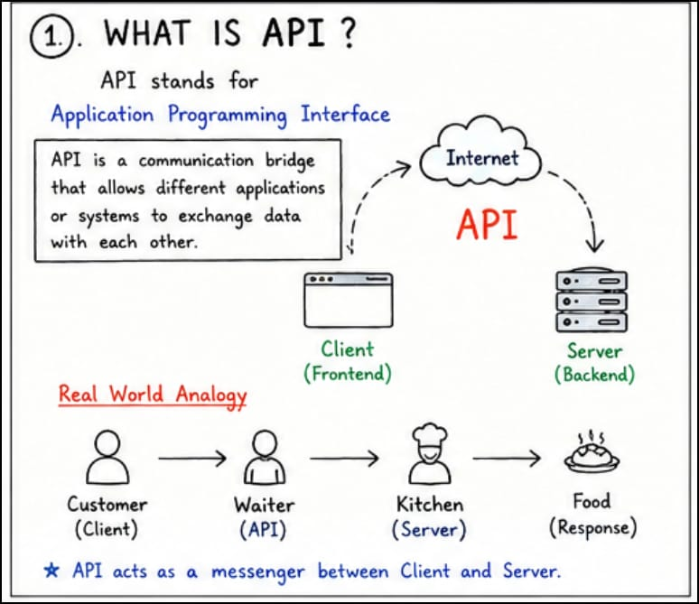
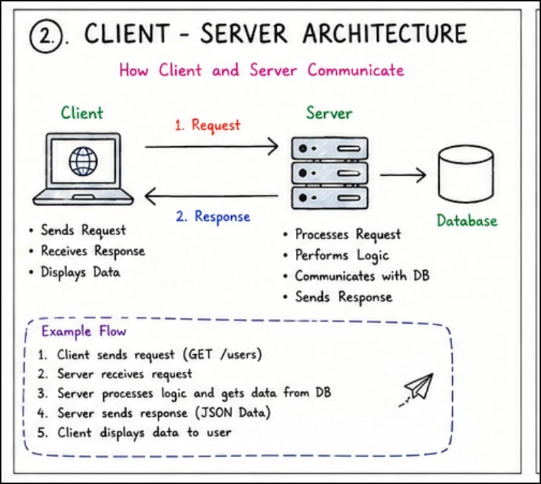
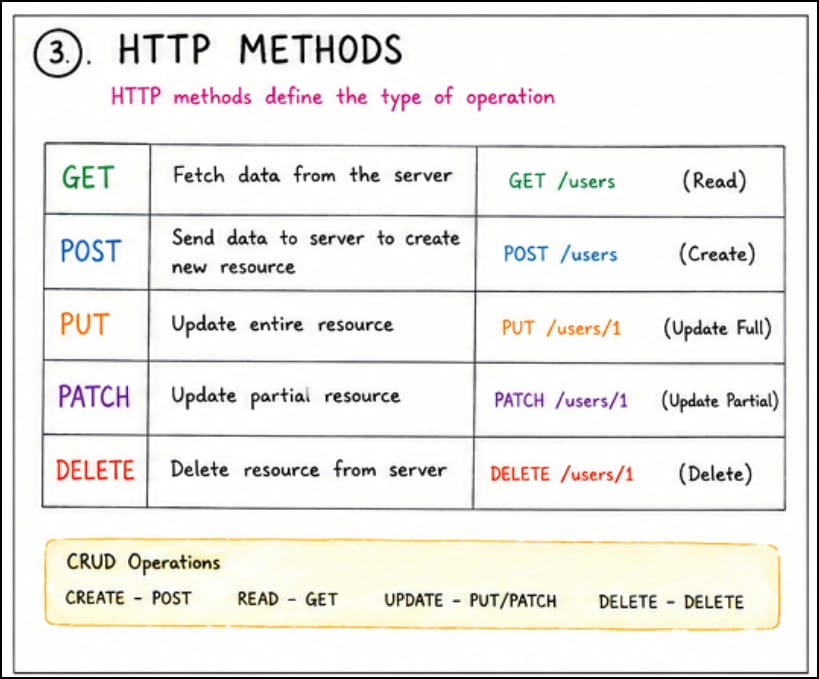
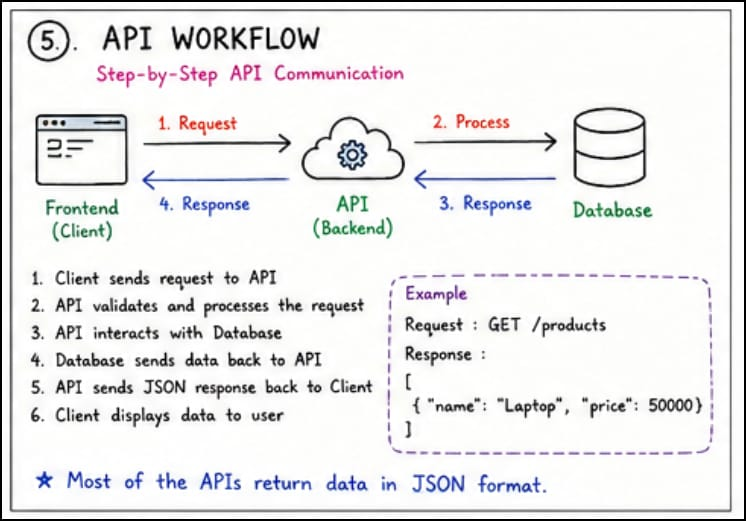
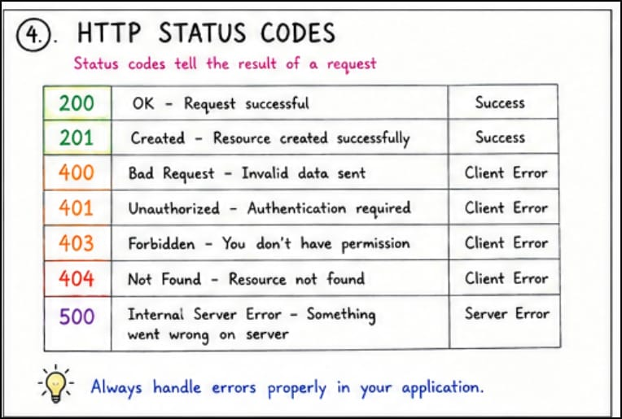
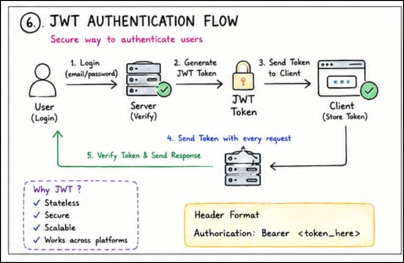
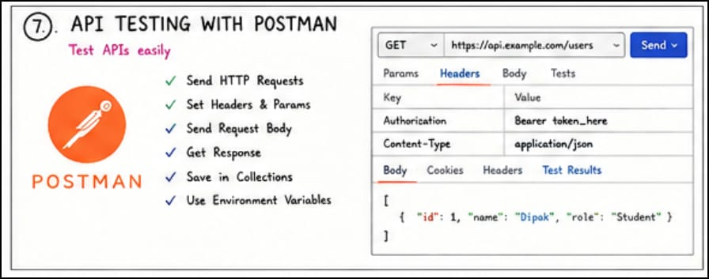
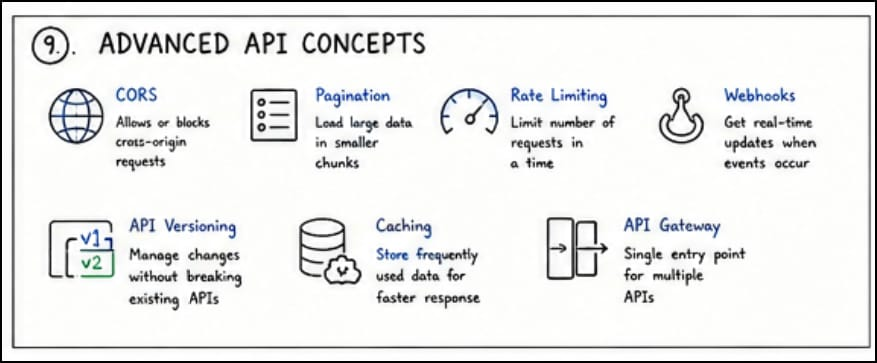
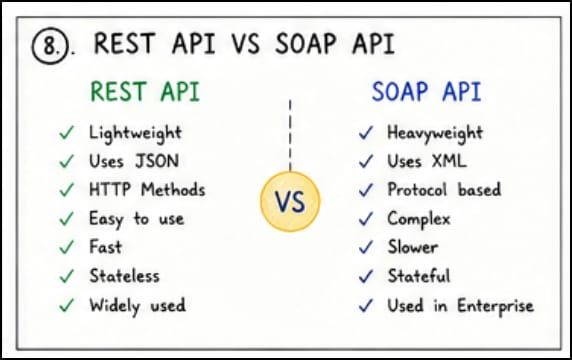

# 🚀 API & REST API — Complete Beginner to Advanced Guide

> A practical and beginner-friendly guide to understanding APIs, REST APIs, backend communication, authentication, API testing, and real-world API workflows used in modern web applications.

This repository documents my complete learning journey of APIs — from understanding the basics of client-server communication to learning how real-world applications exchange data securely and efficiently.

The goal of this repository is not just to memorize HTTP methods or API definitions.

The main focus is:

* Understanding how applications communicate internally
* Learning how frontend and backend work together
* Understanding real-world API workflows
* Learning API testing practically
* Building strong backend fundamentals
* Understanding authentication and security
* Learning how scalable systems are designed

This repository is written in simple and structured language so that:

* Beginners can understand concepts easily
* Non-IT students can learn comfortably
* Developers can strengthen backend fundamentals
* Interview preparation becomes easier
* Real-world API workflows become clear

---

# 📚 Topics Covered

## 🟢 API Fundamentals

* What is API?
* Why APIs are important
* Client & Server
* Request & Response
* HTTP & HTTPS
* JSON
* REST API
* API Workflow
* API Endpoints

---

## 🌐 HTTP Methods

* GET
* POST
* PUT
* PATCH
* DELETE

---

## ⚙️ HTTP Status Codes

* 200 OK
* 201 Created
* 400 Bad Request
* 401 Unauthorized
* 403 Forbidden
* 404 Not Found
* 500 Internal Server Error

---

## 🔐 Authentication & Security

* Authentication
* Authorization
* JWT Authentication
* Bearer Token
* API Keys
* OAuth Basics

---

## 🧪 API Testing

* Postman Basics
* Headers
* Params
* Request Body
* Collections
* Environment Variables
* API Debugging

---

## 📄 Swagger / API Documentation

* API Documentation
* Endpoints
* Parameters
* Request Examples
* Response Examples
* Swagger UI

---

## ⚛️ Frontend API Integration

* Fetch API
* Axios
* Async/Await
* CRUD Operations
* Error Handling
* Loading State

---

## 🛠 Backend API Development

* Express.js APIs
* REST API Creation
* Routes
* Middleware
* CRUD APIs
* Validation
* Error Handling

---

## 🚀 Advanced API Concepts

* REST vs SOAP
* REST vs GraphQL
* CORS
* Pagination
* Rate Limiting
* Webhooks
* API Versioning
* Caching
* API Gateway

---

# 🟢 What is API?


API stands for:

> **Application Programming Interface**

## ✅ Simple Definition

> API is a communication bridge that allows different applications or systems to exchange data with each other.

APIs help software systems communicate in a structured and secure way.

In modern applications, APIs are responsible for connecting:

* Frontend and backend
* Mobile apps and servers
* Payment systems
* Databases
* Third-party services
* Cloud platforms

Without APIs, modern applications cannot communicate properly.

---

# 🧠 Real-World Understanding of API

Imagine a restaurant.

* Customer gives order
* Waiter takes order to kitchen
* Kitchen prepares food
* Waiter brings food back

Here:

* Customer → Client
* Kitchen → Server
* Waiter → API

The API acts as a messenger between the client and the server.

The client never directly communicates with the database or internal server logic.

API handles communication safely and efficiently.

---

# 🌍 Real-World API Examples

## 1️⃣ Weather Application

When you open a weather app:

* App sends request to weather server
* Server processes request
* API returns weather data
* App displays temperature and forecast

This communication happens using APIs.

---

## 2️⃣ Google Pay / PhonePe

Payment applications use APIs to:

* Verify bank accounts
* Transfer money
* Check balances
* Confirm transactions

Modern digital payments completely depend on APIs.

---

## 3️⃣ Instagram / YouTube

When users refresh feed:

* Frontend sends API request
* Backend fetches data
* API returns posts/videos
* UI displays content

APIs are responsible for loading dynamic content.

---

# 🌐 What is Client & Server?


This is one of the most important backend concepts.

---

# 🖥 Client

Client is the application or interface requesting data.

Examples:

* Browser
* Mobile app
* React frontend
* Android application

Client mainly:

* Sends requests
* Receives responses
* Displays data

---

# 🗄 Server

Server is the backend system that processes requests and manages data.

Server mainly:

* Handles business logic
* Processes requests
* Verifies users
* Communicates with database
* Sends responses

---

# 🔄 Client-Server Communication Flow

## Step 1 — Client Sends Request

Frontend or mobile app sends request.

Example:

```bash id="ctjlwm"
GET /products
```

---

## Step 2 — Server Receives Request

Backend server receives request.

---

## Step 3 — Backend Processes Logic

Server performs:

* Validation
* Authentication
* Business logic
* Database operations

---

## Step 4 — Database Operation Happens

Data is fetched or updated.

---

## Step 5 — Server Sends Response

Server returns response.

Example:

```json id="t33nfx"
[
  {
    "name": "Laptop",
    "price": 50000
  }
]
```

---

## Step 6 — Frontend Displays Result

Frontend displays result to user.

---

# 🌍 What is HTTP?


HTTP stands for:

> **HyperText Transfer Protocol**

HTTP is the communication protocol used to transfer data over the internet.

Whenever frontend communicates with backend, HTTP is used.

---

# 🔒 What is HTTPS?

HTTPS is the secure version of HTTP.

The extra “S” means:

> Secure

HTTPS encrypts data before sending it.

Used in:

* Banking systems
* Login systems
* Payment applications
* Secure websites

---

# 📦 What is JSON?

JSON stands for:

> **JavaScript Object Notation**

JSON is the most commonly used data format in APIs.

JSON is:

* Lightweight
* Human-readable
* Easy to send
* Easy to understand

---

# 📌 Example JSON

```json id="nf9n32"
{
  "name": "Dipak",
  "course": "MERN Stack",
  "city": "Nagpur"
}
```

Backend usually sends data in JSON format.

Frontend reads JSON and displays information.

---

# 🌐 What is REST API?


REST stands for:

> **Representational State Transfer**

REST API is the most commonly used API architecture in modern applications.

REST APIs mainly use:

* HTTP methods
* URLs
* JSON data

REST APIs are:

* Lightweight
* Fast
* Scalable
* Easy to maintain
* Easy to understand

Most modern applications use REST APIs.

---

# 📌 Example REST API

```bash id="2srdv4"
GET /users
```

Meaning:

➡️ Fetch all users from the server.

---

# 🌐 What is Endpoint?

Endpoint is a specific API URL used to access resources or perform operations.

Examples:

```bash id="4gh9gl"
/users
/products
/orders
```

Different endpoints perform different operations.

---

# 🌐 HTTP Methods

HTTP methods define what operation should happen on server.

---

# 1️⃣ GET Method

GET method is used to fetch data from server.

## Example

```bash id="wyhy10"
GET /users
```

## Real-World Example

Loading Instagram posts.

## Important Points

* GET only fetches data
* GET does not modify data
* Frequently used in frontend applications

---

# 2️⃣ POST Method

POST method is used to create new data.

## Example

```bash id="y1hyck"
POST /users
```

## Request Body

```json id="q8gx4w"
{
  "name": "Rahul",
  "email": "rahul@gmail.com"
}
```

## Real-World Example

Creating a new account.

## Important Points

* POST creates resources
* POST sends data to server
* Used in forms and registrations

---

# 3️⃣ PUT Method

PUT method updates complete data.

## Example

```bash id="jlwmys"
PUT /users/1
```

## Real-World Example

Updating complete profile information.

## Important Points

* PUT replaces full resource
* Existing data gets fully updated

---

# 4️⃣ PATCH Method

PATCH method updates partial data.

## Example

```bash id="hhw9u6"
PATCH /users/1
```

## Real-World Example

Updating only profile photo.

## Important Points

* PATCH updates specific fields
* More efficient for small updates

---

# 5️⃣ DELETE Method

DELETE method removes data from server.

## Example

```bash id="3tmf9j"
DELETE /users/1
```

## Real-World Example

Deleting user account permanently.

## Important Points

* DELETE removes resources
* Used carefully in production systems

---

# ⚙️ HTTP Status Codes


Status codes tell whether request succeeded or failed.

They help frontend developers understand server responses properly.

---

# ✅ 200 OK

Request completed successfully.

Example:

* Data fetched successfully

---

# ✅ 201 Created

New resource created successfully.

Example:

* New account created

---

# ❌ 400 Bad Request

Client sent invalid data.

Example:

* Missing required fields
* Invalid input format

---

# 🔒 401 Unauthorized

User is not authenticated.

Example:

* Token missing
* User not logged in

---

# ⛔ 403 Forbidden

User does not have permission.

Example:

* Normal user trying to access admin routes

---

# ❌ 404 Not Found

Requested API or resource was not found.

Example:

* Wrong API URL

---

# 💥 500 Internal Server Error

Something went wrong on backend server.

Example:

* Database error
* Backend crash

---

# 🔐 Authentication vs Authorization

These are very important backend concepts.

---

# 🔑 Authentication

Authentication means:

> Verifying who the user is.

Example:

* Login using email and password

When users log in, backend verifies identity.

---

# 🛡 Authorization

Authorization means:

> Checking what the user can access.

Example:

* Admin can delete users
* Normal users cannot

Authorization controls permissions and access.

---

# 🔑 JWT Authentication


JWT stands for:

> **JSON Web Token**

JWT is used for secure authentication systems.

It helps backend verify users securely.

---

# 🔄 JWT Workflow

## Step 1

User logs in.

---

## Step 2

Server verifies credentials.

---

## Step 3

Server creates token.

---

## Step 4

Frontend stores token.

---

## Step 5

Frontend sends token with every request.

---

# 📌 Example Authorization Header

```bash id="z2rjwx"
Authorization: Bearer token_here
```

---

# 🧪 What is Postman?


Postman is a tool used for API testing.

Developers use Postman to:

* Send requests
* Test APIs
* Debug APIs
* Check responses
* Save collections

---

# 🚀 Why Postman is Important?

Postman helps developers test backend APIs without frontend.

This improves:

* Backend testing
* Faster debugging
* API verification
* Development workflow

---

# 📄 What is Swagger?

Swagger is an API documentation tool.

Swagger helps developers understand APIs easily.

It provides:

* Endpoints
* Methods
* Parameters
* Request examples
* Response examples
* Authentication details

Swagger improves collaboration between frontend and backend developers.

---

# ⚛️ Frontend API Integration

Frontend applications communicate with backend using APIs.

Most common methods:

* Fetch API
* Axios

---

# 🚀 Using Fetch API

```javascript id="6d3udv"
async function getUsers() {
  const response = await fetch(
    "https://jsonplaceholder.typicode.com/users"
  );

  const data = await response.json();

  console.log(data);
}

getUsers();
```

---

# 🚀 Using Axios

```javascript id="oh7zsh"
import axios from "axios";

async function getUsers() {
  const response = await axios.get(
    "https://jsonplaceholder.typicode.com/users"
  );

  console.log(response.data);
}

getUsers();
```

---

# 🌍 CRUD Operations

CRUD means:

* Create
* Read
* Update
* Delete

These are the most important backend operations.

---

# CREATE

```javascript id="p4wnws"
axios.post("/users", data);
```

---

# READ

```javascript id="iv7u41"
axios.get("/users");
```

---

# UPDATE

```javascript id="ffzvxy"
axios.put("/users/1", data);
```

---

# DELETE

```javascript id="wfnm4l"
axios.delete("/users/1");
```

---

# 🛠 Backend API Development Using Express.js

Express.js is a Node.js framework used to create backend APIs.

It helps developers:

* Create routes
* Handle requests
* Send responses
* Build REST APIs easily

---

# 🚀 Simple REST API Example

```javascript id="8p2ax7"
const express = require("express");
const app = express();

app.use(express.json());

app.get("/users", (req, res) => {
  res.json({ message: "All Users" });
});

app.post("/users", (req, res) => {
  res.json({ message: "User Created" });
});

app.listen(3000, () => {
  console.log("Server Running");
});
```

---

# 🚀 Advanced API Concepts


---

# 🔀 REST vs SOAP


## REST

* Lightweight
* Uses JSON
* Faster
* Easier to learn
* Widely used

---

## SOAP

* XML based
* Strict protocol
* More complex
* Used in enterprise systems

---

# ⚡ REST vs GraphQL

## REST

* Multiple endpoints
* Fixed response structure

---

## GraphQL

* Single endpoint
* Client chooses required data
* Prevents unnecessary data fetching

---

# 🌍 What is CORS?

CORS stands for:

> **Cross-Origin Resource Sharing**

CORS controls which frontend applications can access backend APIs.

It is an important browser security feature.

---

# 📄 Pagination

Pagination loads data in smaller parts.

Instead of loading thousands of records together, APIs load limited data.

Example:

```bash id="wnc9ye"
GET /products?page=1&limit=10
```

---

# ⚡ Rate Limiting

Rate limiting prevents API abuse.

Example:

* Only 100 requests allowed per minute

Rate limiting improves:

* Security
* Traffic control
* Server stability

---

# 🔔 What are Webhooks?

Webhooks automatically send data when events happen.

## Real-World Examples

* Payment successful
* GitHub push event
* New order placed
* Email notifications

Webhooks enable real-time communication between systems.

---

# 🧠 API Best Practices

Good APIs follow proper standards.

---

# ✅ Best Practices

* Use meaningful endpoint names
* Validate request data
* Handle errors properly
* Use proper status codes
* Secure APIs with authentication
* Keep response structure consistent
* Write proper documentation
* Use pagination for large data

---

# 🎯 Important API Interview Questions

## 1️⃣ What is API?

API allows communication between applications.

---

## 2️⃣ What is REST API?

REST API is an API architecture using HTTP methods.

---

## 3️⃣ Difference between PUT and PATCH?

* PUT updates full resource
* PATCH updates partial resource

---

## 4️⃣ Difference between Authentication and Authorization?

* Authentication → Who are you?
* Authorization → What can you access?

---

## 5️⃣ What is JWT?

JWT is a token-based authentication system.

---

## 6️⃣ What is CORS?

CORS controls cross-origin requests.

---

## 7️⃣ Difference between REST and GraphQL?

REST uses multiple endpoints.

GraphQL uses single endpoint.

---

## 8️⃣ What is Status Code 404?

Requested resource was not found.

---

# 💡 What I Learned

While learning APIs, I understood:

* APIs are the backbone of modern applications
* Frontend and backend communicate using APIs
* Authentication improves security
* API workflows are important in real-world systems
* Postman makes testing easier
* Strong fundamentals improve backend development
* Understanding concepts is more important than memorizing syntax

---

# 🧠 My Understanding (Simple Definition)

> API is a communication bridge between applications.

Frontend asks for data.

Backend processes request.

API transfers communication between them.

---

# 🎯 Why I Created This Repository

I created this repository to:

* Strengthen my API fundamentals
* Understand backend communication deeply
* Learn API integration practically
* Improve backend development skills
* Practice API testing
* Build better development habits
* Create beginner-friendly learning notes
* Track my learning journey

---

# 🚀 Future Improvements

Planned improvements:

* Learn advanced authentication deeply
* Build production-level APIs
* Learn GraphQL practically
* Add API deployment concepts
* Learn microservices architecture
* Learn WebSocket & real-time APIs
* Add payment gateway integration
* Learn API monitoring & logging

---

# 🤝 Final Note

This repository reflects my practical understanding of APIs and backend communication as a learner and developer.

The goal is not only to learn syntax.

The goal is to understand:

* How applications communicate
* How scalable systems work
* How frontend and backend interact
* How secure APIs are built
* How modern applications exchange data

I will continue improving this repository while learning more advanced backend concepts and real-world workflows.
